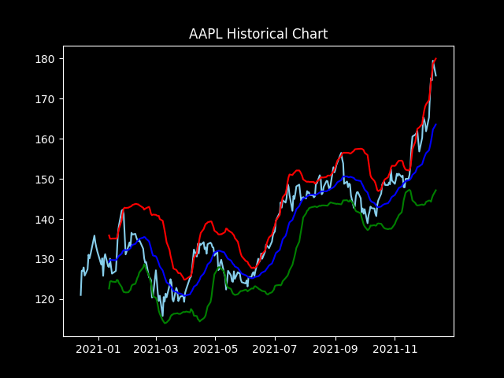
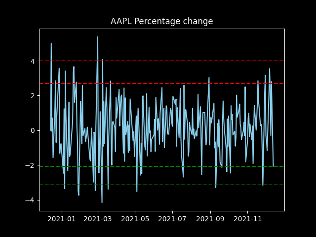

# Plot_stocks_with_YahooFinanceAPI
Plot techincal analysis tools such as RSI, BBI, Best Fit Line, simple moving average and percentage changes on stocks with the Yahoo Finance API and try out some pre-made trading strategies using Python.

## The strategies:

### TestLinearRegression_strats:
#### Strategy1 def LinearRegression1(self, interval, tradeSum=10000, comission=40):
We buy the stock when the regression line shows that we have an upward movement and keep on holding to our position until the regression line goes in a downward trend. We then sell with a hope that the price moved enough so that we made a profit

#### Strategy2 def LinearRegression2(self, interval, maxMoneyToSpend=10000, maxMoneyToSpendEachTrade=2000, comission=40):
Same as strategy1 except that we have an additional parameter that decide how much money that can be placed at each trade. By default we only make an order for 2000$ at each trade and keep on buyung when the regression has a psitive trend and sell whenever it has a negative trend. With this strategy you dont go all in at once, but buy in portions which can hedge your downside and potentially buy at lower prices since the regression line only shows you the movement of the stock. However, if the stock keeps moving, you would also end up buy at a higher price at each trade. 

### TestMA_strats:
Two widely used strategies in the real world implemented in simple terms
I have implemented two MA's:
#### MA50_100 def MA50_100(self, show=False, tradingPower=10000):
If the MA50-line crosses the MA100-line from beneath, we then buy the stock and keep holding it until the MA50-line crosses the MA100-line again from above
#### MA20_50 def MA20_50(self, show=False, tradingPower=10000):
If the MA20-line crosses the MA50-line from beneath, we then buy the stock and keep holding it until the MA50-line crosses the MA100-line again from above

### The mean stategy def meanStrat(self, tradingPower=10000):
Based upon finding the mean price of what a stock has been during a couple of days. If the price of that stock falls below
this mean price, we will buy some stocks because we in theory can believe that the price will increase back to the mean price.

However in this case we will sell them again at the moment the price of the stock can be sold for a profit. 
Since we expect the price to rise again, we can asume that there is a fair chance of making a profit since the price should
go up.

### RSI strategies
#### strategy1 def RSI_strat1(self, tradingpower=10000):

Simple, just buy the stock when the RSI-level reaches or is above 65 and sell when it goes below 55

#### strategy2 def RSI_strat2(self): 
Buy the stock in multiple blocks while RSI shows momentum in the stock, which is when the RSI-level has risen between 45, and sell when the RSI-level is above 65

#### strategy3 def RSI_strat3(self, tradingpower=10000, RSI_buy=40, RSI_sell=60):  

We check what the mean RSI level has been during the last week and if the RSI_buy level now is higher or the same, we buy because we believe that the momentum will continue to increase further until it reaches 60. However which RSI-level you prefer to sell at, can be changed in the method

#### strategy4 def RSI_strat4(self, tradingpower=10000, RSI_value=60): 
If the RSI level is above the preferred value, we buy and sell as soon as the stock can be sold for profit.

## Example plot: Historical chart of AAPL 

## Example plot: RSI chart of AAPL 

## Example plot: Percentage change chart of AAPL

